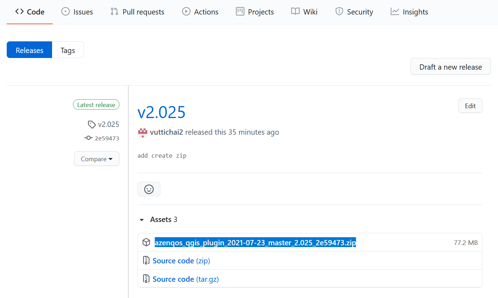
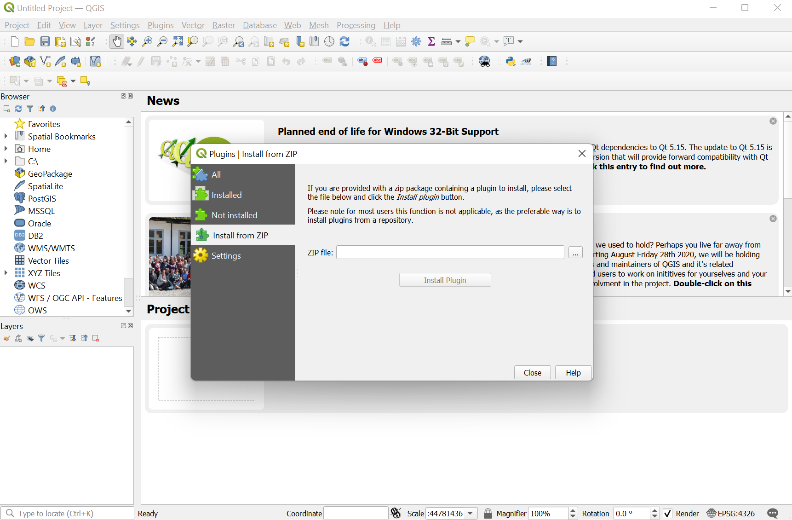

AZENQOS Log Replay QGIS Plugin
==============================

Install this plugin into QGIS to analyze AZENQOS '.azm' test logs: analyze Layer-3 Signalling, Events, 5GNR/LTE/WCDMA/GSM mesurements - all syncing with the QGIS map plot of your test log captured from the [AZENQOS Android Drivetest tool](https://www2.azenqos.com/) app.

Installation instructions
-------------------------

- Install QGIS Standalone Installer from: 
  - Open a web browser to: <https://qgis.org/en/site/forusers/download.html>
  - Click on 'Downloads for Windows'
  - Scroll down to 'Long term release (most stable)'
  - Click on 'QGIS Standalone Installer (64 bit)' to start download.
  - Install the downloaded file.

- Download Azenqos QGIS Plugin
  - Click on 'Releases' button at the right of page or [click here](https://github.com/freewillfx-azenqos/azenqos_qgis_plugin/releases).
  - Find the latest releases and download azenqos_qgis_plugin_xxxx.zip in assets section as below screenshot.

- In QGIS, go to 'Plugins' > 'Manage and install plugins' > 'Installed from ZIP' and Browse for the ZIP that you have downloaded then click "Installed Plugin" button as below screenshot.

- Restart QGIS
- Press on the AZENQOS icon button in toolbar (or in 'Plugins') - the analyzer window will launch.
- In the analyzer window, go to File > Open log file... to choose a .azm log file to analyze.
- After a log has been opened. Go to Presentation to open each required analyzer window - like Signalling > Layer-3 Messages.

- Repeat the same steps above when you want to upgrade the plugin to a new version (version is shown at top-right of analyzer window).

Using Standlone mode to replay/analyze logs without QGIS (Developer mode)
------------------------------------------------------------

- Install common requirements, run:
`pip3 install -r requirements-dev.txt`

- Install pyqt5
  - If you are on Windows, install Python 3.8.5 first, then in the command prompt, get into this folder and run:
  `pip3 install -r requirements-dev-windows.txt`
  - If you are on Ubuntu, open a terminal and run (not required if qgis is already installed):
  `sudo apt install python3-pyqt5`
  
- Launch analyzer in standalone mode, cd into this folder and run:
`cd Azenqos`
`python3 ui_test_main_window.py`

Running tests (install developer mode dependencies in previous step first)
----------------------------------------------------------------

- Non-ui tests: run `./test.sh` in 'Azenqos' folder for GNU/Linux, otherwise use pytest.
- Testing specific ui dialogs/windows: run ui_test_* files with python3, for example - to launch main window in standalone (non-QGIS) mode - do: `python3 ui_test_main_window.py`
- Testing specific QGIS functions at start of pressing the qgis plugin button (instead of launching the main_window): create a file named `debug_qgis_pyexec` in this folder and put your python code to test in there, for example: `import qgis_test_csv_layer`. Then launch QGIS, tap on the azenqos plugin icon in toolbar - it would run your code only.

License
-------

- Released under the GNU GPL version 2. Please see [LICENSE](LICENSE) file.

Copyright (C) 2019-2020 Freewill FX Co., Ltd.

This program is free software; you can redistribute it and/or
modify it under the terms of the GNU General Public License
as published by the Free Software Foundation; either version 2
of the License, or (at your option) any later version.

This program is distributed in the hope that it will be useful,
but WITHOUT ANY WARRANTY; without even the implied warranty of
MERCHANTABILITY or FITNESS FOR A PARTICULAR PURPOSE.  See the
GNU General Public License for more details.

You should have received a copy of the GNU General Public License
along with this program; if not, write to the Free Software
Foundation, Inc., 51 Franklin Street, Fifth Floor, Boston, MA  02110-1301, USA.

Special thanks and notices
--------------------------

- This project (which is licensed under the GNU GPLv2 - same as Wireshark) uses `tshark` and `text2pcap` utilities from the Wireshark project. Full credit and thanks to the Wireshark developers for their great work. Please see [wireshark_LICENSE](wireshark_LICENSE) file for its license and [wireshark_SOURCE](wireshark_SOURCE) for its source.

